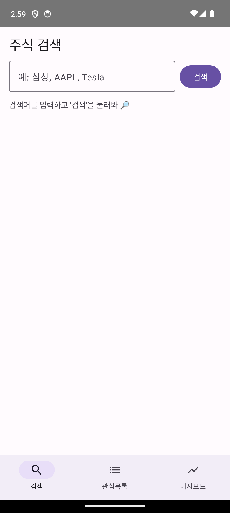
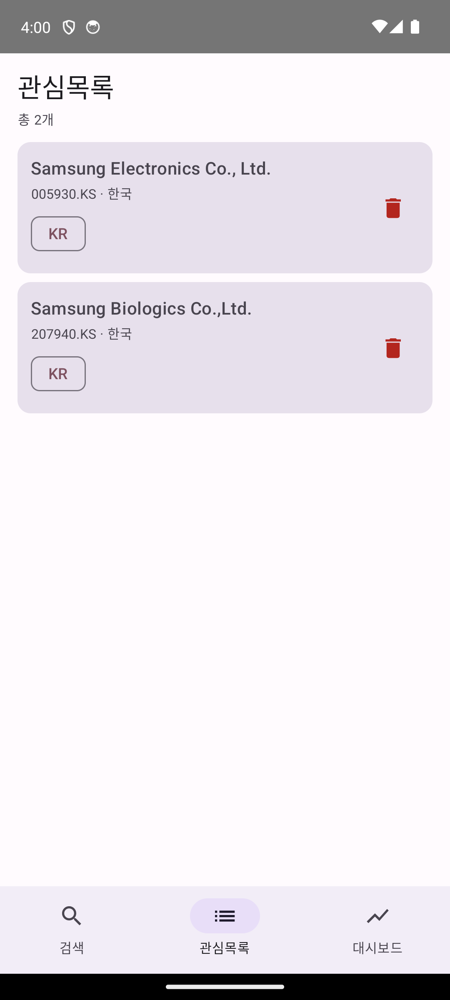
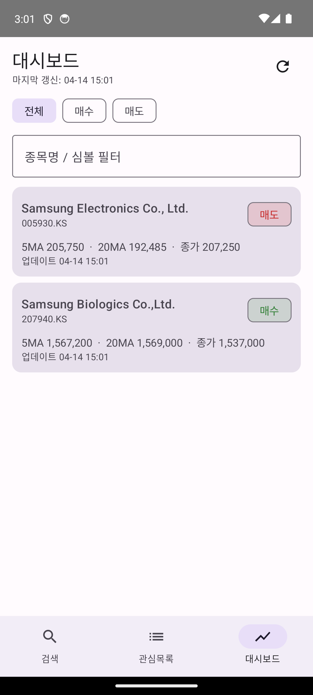
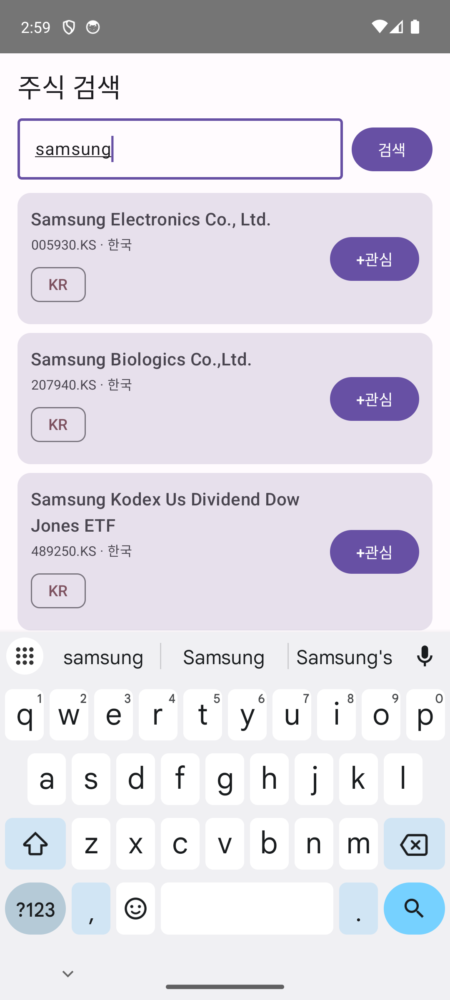
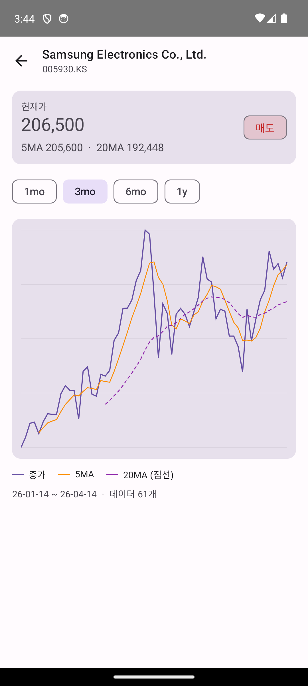
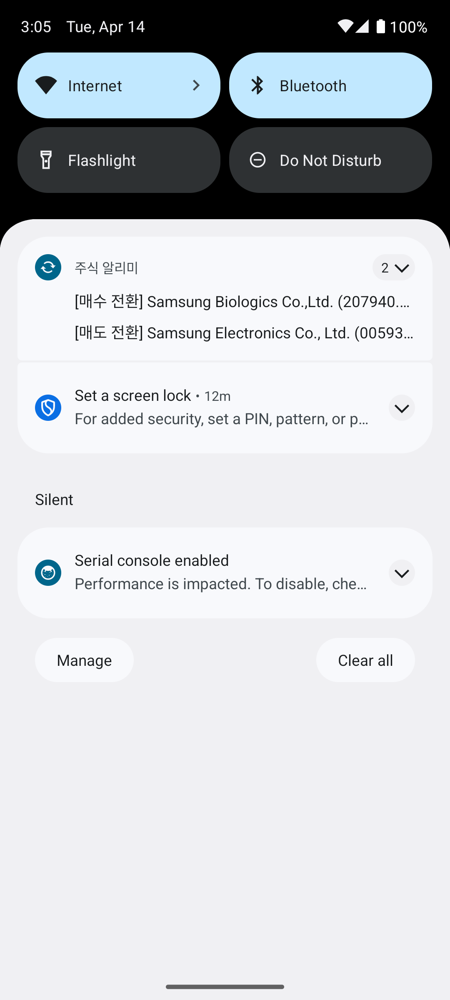

<p align="center">
  
</p>

<h1 align="center">주식 알리미 (Stock Alarm) ✨</h1>

<p align="center">
  한국·미국 주식의 <b>5일/20일 이동평균 교차</b>를 자동 감지해서 푸시 알림을 보내주는 안드로이드 네이티브 앱.<br/>
  Android Studio GUI 없이 <b>터미널만으로</b> 편집·빌드·설치·검증한 Jetpack Compose 프로젝트.
</p>

---

## 📥 빠른 설치

최신 APK 바로 받기:

**👉 [`dist/stock-alarm-debug.apk`](dist/stock-alarm-debug.apk)** (약 18 MB, minSdk 26 = Android 8.0+)

1. 위 링크를 안드로이드 기기 브라우저로 열어 다운로드
2. 설정 → **알 수 없는 출처에서 앱 설치 허용**
3. 파일 매니저에서 APK 탭 → 설치
4. 첫 실행 시 **알림 권한** 허용

> 디버그 키로 서명된 APK라 처음 설치 시 보안 경고가 뜰 수 있어. 무시하고 설치하면 돼.

---

## 🔄 관심목록을 유지하면서 업데이트하기

**핵심**: `adb uninstall` 후 재설치하면 로컬 DB(관심목록)가 **전부 날아간다**. 아래 방법을 써야 기존 관심 종목이 유지돼.

### 기본 원리 — `adb install -r`

`-r` 플래그가 **"replace existing app, preserve data"**를 의미해.

```bash
# PC ↔ 폰이 USB/Wi-Fi ADB로 연결된 상태에서:
adb install -r stock-alarm-debug.apk
```

이렇게 하면 앱은 최신 APK로 바뀌지만 Room DB(`/data/data/com.example.playground/databases/playground.db`)는 그대로 남아. 관심목록·이평선 상태(lastStatus) 전부 유지돼.

### 개발 머신에서는

```bash
./gradlew installDebug
```

이 명령은 내부적으로 `adb install -r`을 호출하므로 같은 효과.

### 실기기 사이드로딩 (USB 없이)

1. 새 APK를 폰으로 다운로드
2. 파일 매니저에서 APK 탭
3. "업데이트하시겠습니까?" 다이얼로그가 뜨면 **그대로 확인**
4. 절대 "삭제 후 설치" 또는 "설정 → 앱 → 삭제" 하지 말 것

### 업데이트가 거부되는 경우

- **"버전이 낮거나 같음"** 에러: 새 APK의 `versionCode`가 이전보다 높아야 해. 이 프로젝트는 릴리스마다 `app/build.gradle.kts`의 `versionCode`·`versionName`을 올려.
- **"서명 불일치"** 에러: 다른 머신에서 빌드된 APK면 디버그 키가 달라 덮어쓰기가 안 돼. 이 경우는 어쩔 수 없이 uninstall 필요. 공식 배포를 하려면 release keystore를 따로 만들어 고정해야 함.
- **"제조사 절전 정책"**: 설치 자체는 되지만, WorkManager 15분 주기가 샤오미·화웨이 등 일부 OEM의 공격적인 절전 때문에 작동 안 할 수 있음. 설정 → 배터리 → 제한 없음으로 바꿔줘.

---

## 🎯 기능

- 🔍 **주식 검색** — 한국(KOSPI/KOSDAQ)·미국(NASDAQ/NYSE) 종목 동시 검색
- ⭐ **관심목록** — 검색한 종목을 추가/삭제, 시장(KR/US) 칩 표시
- 📈 **이평선 교차 감지** — 15분 주기로 종가 갱신 후 5MA / 20MA 대소 관계 변화 감지
- 🔔 **푸시 알림** — 매수/매도 전환 순간에 알림 발송
- 🗂 **대시보드** — 관심 종목 현재 상태 + 매수/매도/종목명 필터
- 📊 **차트 화면** — 카드를 탭하면 종가·5MA·20MA 라인 차트 (1mo / 3mo / 6mo / 1y 토글, Compose Canvas로 직접 렌더링)
- ⚙ **데이터 소스 선택** _(v0.3.0)_ — 설정 탭에서 Yahoo Finance / 한국투자증권(KIS) Open API 중 선택. 검색은 항상 Yahoo, 시세·차트·15분 워커만 선택한 소스로 동작
- 🔐 **KIS 키 암호화 저장** _(v0.3.0)_ — AppKey/Secret은 Android Keystore 기반 `EncryptedSharedPreferences`에 암호화 저장, access token은 메모리 전용

### 매수/매도 정의

> **5MA < 20MA → 매수**  ·  **5MA > 20MA → 매도**
>
> (역추세 / 평균회귀 관점. 일반적인 골든크로스와 반대 방향이니 주의.)

---

## 🖼 화면

| 검색 | 관심목록 | 대시보드 |
|:--:|:--:|:--:|
|  |  |  |

| 검색 결과 | 차트 | 알림 |
|:--:|:--:|:--:|
|  |  |  |

---

## 🛠 기술 스택

| 분류 | 사용 |
|---|---|
| 언어·UI | Kotlin 1.9.23 + Jetpack Compose (BOM 2024.05.00) + Material3 |
| 빌드 | Gradle 8.7 (wrapper) + AGP 8.3.2, JDK 17 |
| 아키텍처 | MVVM + 수동 DI(ServiceLocator) — Hilt 사용 안 함 |
| 네트워킹 | Retrofit 2.11 + OkHttp 4.12 + kotlinx.serialization |
| 로컬 DB | Room 2.6.1 (KSP) |
| 백그라운드 | WorkManager 2.9 (Periodic 15분) |
| 보안·설정 | security-crypto 1.1.0-alpha06 (EncryptedSharedPreferences) + DataStore Preferences 1.1.1 |
| 차트 | Compose `Canvas` + `Path`/`PathEffect` (외부 라이브러리 0) |
| 데이터 소스 | Yahoo Finance (기본) **+ 한국투자증권 KIS Open API** (v0.3.0~) |
| 최소 SDK | 26 (Android 8.0) / target 34 (Android 14) |

### 패키지 구조

```
com.example.playground
├── PlaygroundApp                   Application, 알림 채널 + WorkManager 15분 enqueue
├── MainActivity                    setContent { PlaygroundApp() } + 알림 권한 요청
├── di/ServiceLocator               싱글톤 그래프 (DB·Repository·데이터 소스·KIS 스택·설정)
├── data/
│   ├── model/                       MaStatus, Market, StockSearchResult, WatchedStock, ChartData
│   ├── local/                       Room (AppDatabase, WatchlistDao, Converters)
│   ├── remote/                      YahooFinanceApi + NetworkModule + DTO
│   ├── prefs/AppSettings            DataStore 기반 설정
│   ├── source/
│   │   ├── StockDataSource          추상 인터페이스
│   │   ├── YahooFinanceDataSource
│   │   └── kis/                     KIS Open API 스택 (네트워크·토큰·키 저장·심볼 변환)
│   └── repo/StockRepository         검색(Yahoo 고정) + 활성 소스 라우팅
├── domain/MaCalculator             5/20일 이평선 + 시리즈 SMA (순수 함수)
├── notification/Notifier           알림 채널 + 교차 전환 알림
├── worker/MaCrossoverWorker        CoroutineWorker, 주기 갱신·알림
└── ui/
    ├── nav/                         4탭 BottomBar Navigation + chart/{symbol} 라우트
    ├── search/                      검색 화면 + ViewModel
    ├── watchlist/                   관심목록 화면 + ViewModel
    ├── dashboard/                   대시보드 + 필터 + [지금 새로고침]
    ├── settings/                    데이터 소스 선택 + KIS 키 관리
    └── chart/                       차트 디테일 + Compose Canvas 라인 차트
```

---

## 🔨 소스에서 빌드

```bash
git clone https://github.com/hojin12312/stock-alarm.git
cd stock-alarm

# 환경: JAVA_HOME=JDK17, ANDROID_HOME=Android SDK
./gradlew installDebug
adb shell am start -n com.example.playground/.MainActivity
```

산출물: `app/build/outputs/apk/debug/app-debug.apk`

---

## ⚠️ 백그라운드 동작에 대한 솔직한 노트

WorkManager `Periodic 15분`은 **최소 주기**이고 정확한 보장이 아니야.

- **Doze 모드**, **App Standby**, 제조사별 **절전 정책**(샤오미·삼성 등)으로 실제 실행은 더 늦어질 수 있음.
- 사용자가 앱을 **강제 종료**하면 WorkManager 작업도 같이 죽는 경우가 있음 (특히 일부 OEM).
- 분 단위 정확한 알림이 필요하면 `AlarmManager.setExactAndAllowWhileIdle` + `SCHEDULE_EXACT_ALARM` 권한, 또는 Foreground Service / 서버 FCM 푸시로 격상 필요.
- Yahoo Finance는 **비공식 API**라 스키마가 변할 수 있음. 안정성이 중요하면 한국투자증권 KIS OpenAPI 등 공식 소스로 교체 고려.

리소스 관점에서는 종목 10개 기준 **하루 약 18MB 데이터, 배터리·CPU는 무시 가능**. WorkManager가 Doze 기간엔 알아서 미루므로 장 외 시간에도 그냥 두는 게 오히려 복잡도가 낮아.

---

## 📝 버전

현재 `v0.3.0` (versionCode 3) — 데이터 소스 선택 + KIS Open API + 보안 하드닝.

| 버전 | 주요 변경 |
|---|---|
| `v0.1.0` | 초기 릴리스: 검색·관심목록·대시보드·알림 |
| `v0.2.0` | 차트 디테일 화면(Compose Canvas) + 앱 아이콘 + `versionCode` 관리 |
| `v0.3.0` | 데이터 소스 선택(Yahoo / 한국투자증권 KIS) + Settings 탭 + AppKey/Secret 암호화 저장 + 네트워크 하드닝(network_security_config, allowBackup=false) |

---

## 📄 라이선스

본 저장소의 코드는 학습·개인 사용 목적으로 자유롭게 활용 가능. Yahoo Finance API 이용 약관은 별도.
